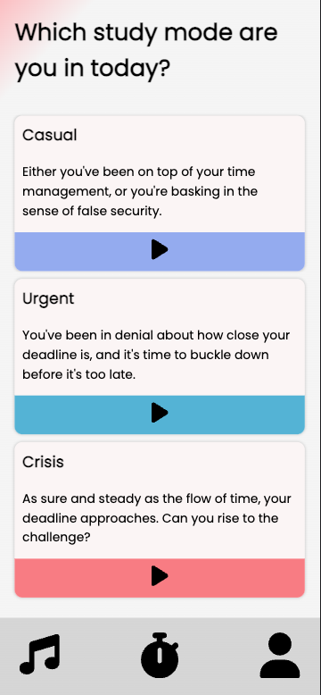
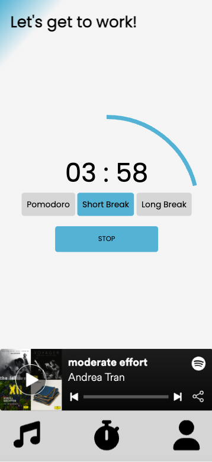
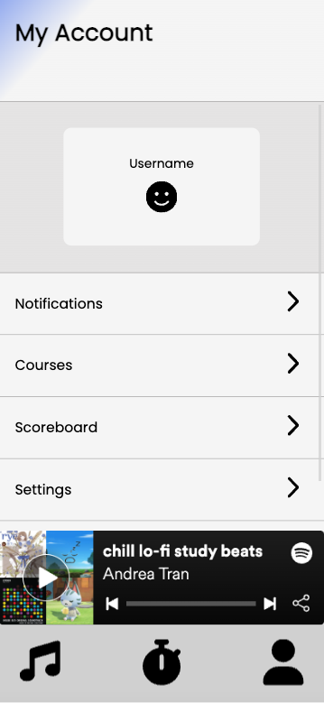

# Overview

Studify Timer is a web application for career procrastinators. It sets a Pomodoro timer and streams curated Spotify playlists based off of how badly the user procrastinated. Created with vanilla Javascript, it is a pseudo-single page application.
To learn more about the creation of this application, check out my [article](https://medium.com/@eyyytran/nurse-to-tech-in-16-weeks-front-end-development-e5993f93d6cc) on Medium

---

## Technologies

-   Javascript
-   HTML
-   CSS
-   Spotify API

---

## How to Use

To use this application, you will need a client id and a client secret from Spotify API. Clone this repo and replace the variables in lines 1-2 in both app.js and frontpage.js with your keys.

---

## Preview

You can preview a walkthrough of the application [here](https://youtu.be/Jp5Ky-3jGeE).

